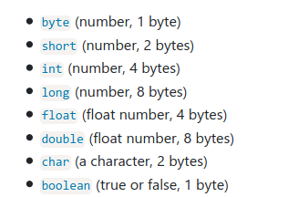
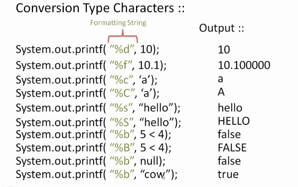
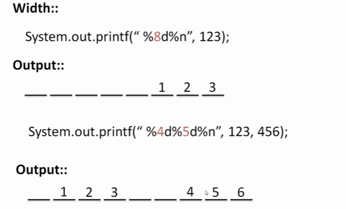

# **JAVA**

---

## Datatypes



## **Declaration**

```java
public class Solution {

    public static void main(String[] args) {
        System.out.println("Hello, World.");
    }
}
```

```
//OUTPUT

Hello, World.
```

---

## **INPUT / OUTPUT**

print , println.

```java
Scanner scanner = new Scanner(System.in);
String myString = scanner.next();
int myInt = scanner.nextInt();
scanner.close();

System.out.println("myString is: " + myString);
System.out.println("myInt is: " + myInt);
```

```
  //INPUT
  Hi 5
  //OUTPUT
  myString is: Hi
  myInt is: 5
```

### Printf [formatting]





---

## **Strings**

### Methods

| Method                                                                                     | Description                                                                                                                             | Return Type  |
| ------------------------------------------------------------------------------------------ | --------------------------------------------------------------------------------------------------------------------------------------- | ------------ |
| [charAt()](https://www.w3schools.com/java/ref_string_charat.asp)                           | Returns the character at the specified index (position)                                                                                 | char         |
| [codePointAt()](https://www.w3schools.com/java/ref_string_codepointat.asp)                 | Returns the Unicode of the character at the specified index                                                                             | int          |
| [codePointBefore()](https://www.w3schools.com/java/ref_string_codepointbefore.asp)         | Returns the Unicode of the character before the specified index                                                                         | int          |
| [codePointCount()](https://www.w3schools.com/java/ref_string_codepointcount.asp)           | Returns the Unicode in the specified text range of this String                                                                          | int          |
| [compareTo()](https://www.w3schools.com/java/ref_string_compareto.asp)                     | Compares two strings lexicographically                                                                                                  | int          |
| [compareToIgnoreCase()](https://www.w3schools.com/java/ref_string_comparetoignorecase.asp) | Compares two strings lexicographically, ignoring case differences                                                                       | int          |
| [concat()](https://www.w3schools.com/java/ref_string_concat.asp)                           | Appends a string to the end of another string                                                                                           | String       |
| [contains()](https://www.w3schools.com/java/ref_string_contains.asp)                       | Checks whether a string contains a sequence of characters                                                                               | boolean      |
| [contentEquals()](https://www.w3schools.com/java/ref_string_contentequals.asp)             | Checks whether a string contains the exact same sequence of characters <br>of the specified CharSequence or StringBuffer                | boolean      |
| [copyValueOf()](https://www.w3schools.com/java/ref_string_copyvalueof.asp)                 | Returns a String that represents the characters of the character array                                                                  | String       |
| [endsWith()](https://www.w3schools.com/java/ref_string_endswith.asp)                       | Checks whether a string ends with the specified character(s)                                                                            | boolean      |
| [equals()](https://www.w3schools.com/java/ref_string_equals.asp)                           | Compares two strings. Returns true if the strings are equal, and false <br>if not                                                       | boolean      |
| [equalsIgnoreCase()](https://www.w3schools.com/java/ref_string_equalsignorecase.asp)       | Compares two strings, ignoring case considerations                                                                                      | boolean      |
| format()                                                                                   | Returns a formatted string using the specified locale, format string, and arguments                                                     | String       |
| getBytes()                                                                                 | Encodes this String into a sequence of bytes using the named charset, storing the result into a new byte array                          | byte[]       |
| getChars()                                                                                 | Copies characters from a string to an array of chars                                                                                    | void         |
| [hashCode()](https://www.w3schools.com/java/ref_string_hashcode.asp)                       | Returns the hash code of a string                                                                                                       | int          |
| [indexOf()](https://www.w3schools.com/java/ref_string_indexof.asp)                         | Returns the position of the first found occurrence of specified characters in a string                                                  | int          |
| intern()                                                                                   | Returns the index within this string of the first occurrence of <br>the specified character, starting the search at the specified index | String       |
| [isEmpty()](https://www.w3schools.com/java/ref_string_isempty.asp)                         | Checks whether a string is empty or not                                                                                                 | boolean      |
| [lastIndexOf()](https://www.w3schools.com/java/ref_string_lastindexof.asp)                 | Returns the position of the last found occurrence of specified characters in a string                                                   | int          |
| [length()](https://www.w3schools.com/java/ref_string_length.asp)                           | Returns the length of a specified string                                                                                                | int          |
| matches()                                                                                  | Searches a string for a match against a regular expression, and returns the matches                                                     | boolean      |
| offsetByCodePoints()                                                                       | Returns the index within this String that is offset from the given index by codePointOffset code points                                 | int          |
| regionMatches()                                                                            | Tests if two string regions are equal                                                                                                   | boolean      |
| [replace()](https://www.w3schools.com/java/ref_string_replace.asp)                         | Searches a string for a specified value, and returns a new string where the specified values are replaced                               | String       |
| replaceFirst()                                                                             | Replaces the first occurrence of a substring that matches the given regular expression with the given replacement                       | String       |
| replaceAll()                                                                               | Replaces each substring of this string that matches the given regular expression with the given replacement                             | String       |
| split()                                                                                    | Splits a string into an array of substrings                                                                                             | String[]     |
| [startsWith()](https://www.w3schools.com/java/ref_string_startswith.asp)                   | Checks whether a string starts with specified characters                                                                                | boolean      |
| subSequence()                                                                              | Returns a new character sequence that is a subsequence of this sequence                                                                 | CharSequence |
| substring()                                                                                | Extracts the characters from a string, beginning at a specified start position, and through the specified number of character           | String       |
| toCharArray()                                                                              | Converts this string to a new character array                                                                                           | char[]       |
| [toLowerCase()](https://www.w3schools.com/java/ref_string_tolowercase.asp)                 | Converts a string to lower case letters                                                                                                 | String       |
| toString()                                                                                 | Returns the value of a String object                                                                                                    | String       |
| [toUpperCase()](https://www.w3schools.com/java/ref_string_touppercase.asp)                 | Converts a string to upper case letters                                                                                                 | String       |
| [trim()](https://www.w3schools.com/java/ref_string_trim.asp)                               | Removes whitespace from both ends of a string                                                                                           | String       |
| valueOf()                                                                                  | Returns the primitive value of a String object                                                                                          | String       |

```java
//split delimiter example


String str = "This is an example string, right?  Yes!";
String delims = "[ .,?!]+";
String[] tokens = str.split(delims);
```

---

## **ARRAYS**

### declare

```java
int intArray[];    //declaring array
intArray = new int[20];  // allocating memory to array


int[] intArray = new int[20]; // combining both statements in one


// returning  array 
        return new int[]{1,2,3}; 
```

1. The elements in the array allocated by *new* will automatically be initialized to **zero** (for numeric types), **false** (for boolean), or **null** (for reference types).Refer [Default array values in Java](https://www.geeksforgeeks.org/default-array-values-in-java/)
2. Obtaining an array is a two-step process. First, you must declare a 
   variable of the desired array type. Second, you must allocate the memory
   that will hold the array, using new, and assign it to the array 
   variable. Thus, **in Java all arrays are dynamically allocated.**

### Array literal

```java
 int[] intArray = new int[]{ 1,2,3,4,5,6,7,8,9,10 }; 
```

### print

```java
for (int e: arr) {
    System.out.println(e)
}        
```

### Methods

- length

- add

- `Arrays.binarySearch(Arr, ele));`

---

## **Hash Maps**

```java
import java.util.HashMap; // import the HashMap class

HashMap<String, String> capitalCities = new HashMap<String, String>();
```

### Put Data(example)

```java
// Add keys and values (Country, City)
    capitalCities.put("England", "London");
    capitalCities.put("Germany", "Berlin");
    capitalCities.put("Norway", "Oslo");
    capitalCities.put("USA", "Washington DC");
```

### Print

```java
System.out.println(capitalCities);
```

```
//output
{USA=Washington DC, Norway=Oslo, England=London, Germany=Berlin} 
```

### Methods

- get()

- remove()

- clear()

- size()

- keySet()

- values()

- containsKey()
